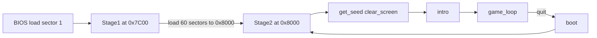

# Architecture

This document describes the boot sequence, memory layout, and module organization of the DND-1 8086 Assembly port.

## Boot sequence

The game is built as a two-stage bootable image. The BIOS loads the first sector of the disk into memory and jumps to it; Stage1 then loads the rest of the game and jumps to Stage2.

1. **BIOS** loads the first 512-byte sector from the boot drive to physical address **0x7C00** and jumps to it.
2. **Stage1** (`SourceFiles/Stage1.asm`):
   - Saves boot drive from `DL`, sets `DS=SS=0`, stack at `BP=SP=0x7F00`.
   - Loads **60 sectors** starting at **sector 2** into **ES:BX = 0:0x8000**.
   - Jumps to **0x8000** (start of Stage2).
3. **Stage2** (`SourceFiles/Stage2.asm`):
   - Re-saves boot drive, sets stack to `BP=SP=0x7FFF`, calls `get_seed` for RNG.
   - If not built with `DEBUG`: `clear_screen` → `intro` → `clear_screen` → `game_loop`. On quit, jumps back to `boot` (restart).
   - If `DEBUG` is defined: includes `Test/Tests.asm` and runs tests instead of the game.

## Memory layout

| Address / range | Content |
|-----------------|--------|
| 0x7C00          | Stage1 boot sector (512 bytes, ends with 0x55 0xAA). |
| 0x7F00          | Stack (Stage1). |
| 0x8000          | Stage2 origin (`ORG 0x8000`). Code, then .bss (Character, Dungeon state), then .data (monsters, save template, strings, constants). |
| 0x7FFF          | Stack (Stage2). |

Stage1 and Stage2 both assume segment 0; all addresses are effectively offsets from 0.

## Module organization (Stage2 includes)

Include order in `Stage2.asm` defines symbol availability. High-level grouping:

- **Libraries (early)**  
  Graphics macros, String macros, DiskIO (so `disk_load` exists for Stage1; `disk_save` only in Stage2).

- **Constants and macros**  
  `Data/Constants/Structures.asm`, `Data/Constants/Macros.asm`.

- **Game libraries**  
  Player, Dungeon, Magic, Inventory (used by intro, loop, and actions).

- **Game flow**  
  Intro, Roll Character, Shop, Load Game, Game Loop.

- **Command dispatch and actions**  
  Get Command, then all action modules (Buy HP, Buy Magic, Cheat, Fight, Battle, Look Around, Move, Open Door, Pass, Search, Switch Weapon, Use Magic).

- **Libraries (late)**  
  ExtendedPrint, StringFunctions, MemoryFunctions, Int (parse_int, random), Dice, KeyboardIO.

- **Sections**  
  `.bss`: `boot_drive`, Character, Dungeon variables.  
  `.data`: Monsters, GameSave, strings, Attributes, Items, Spells, Dungeons, ErrorStrings, LookupTables.

## Key modules

| Module | Role |
|--------|------|
| **Player.asm** | Character stats, HP, gold, damage, death, etc. |
| **Dungeon.asm** | Current dungeon/monster, tile lookup, bounds, map logic. |
| **Magic.asm** | Cleric/wizard spells, casting, effects. |
| **Inventory.asm** | Items, weapon, check/remove from inventory. |
| **Get Command.asm** | Prints command list, reads number 0–12, dispatches to the corresponding action. |
| **Actions (Move, Fight, Battle, etc.)** | Implement each command; many call Dungeon, Player, Inventory, Magic. |

All game logic runs in Stage2; Stage1 only loads sectors and jumps. For known issues and the fix-and-test plan, see [Issues-and-Risks](Issues-and-Risks.md) and [Build-and-Run](Build-and-Run.md) (Testing).
